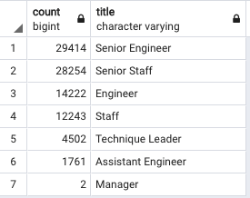
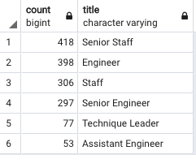

# Pewlett-Hackard-Analysis

### Overview of the analysis: 

The project is for a large company called Pewlett Hackard that employs several thousands of employees.

Employment information was analyzed to assess the number of employees that could be entering the retirement age and determine the number of potential vacancies to fill in the near future. 

To prevent the high increase of retirement, Pewlett Hackard is offering a retirement package by introducing a mentoring program where experienced and successful employees will be stepping back into a part-time role instead of retiring completely. 

The purpose of this analysis is to determine the number of retiring employees per title and identify employees who are eligible to participate in the mentorship program.

### Results: 

1) SQL query that shows Retirement Titles table that holds all the titles of current employees who were born between January 1, 1952 and December 31, 1955. 

-	*There were 133,776 rows in the “retirement titles” table.*

2) Because some employees may have multiple titles in the Retirement Titles table due to promotions, the DISTINCT ON statement was used to create a table that contains the most recent title of each employee.

- *There are 90,398 rows in the “unique titles” table after running the distinct function. The distinct function was added to remove the duplicate rows where a single employee may have had switched positions or received a promotion in the company.*

3) The Number of Retiring Employees by Title:

- *The results show 90,398 employees born between 1952 and 1955 that are soon to retire.* 

- *The “retiring_titles” query table shown below (table 1), there will be retirees in all positions. Senior Engineers have the highest count of retirees, 29,414 and Managers have the lowest count, 2. The data must be reviewed as it may include employees that are no longer employed.*

Table 1:

4) SQL query to create a mentorship-eligibility table that holds the current employees who were born between January 1, 1965 and December 31, 1965:

-	*1,549 employees are eligible for the mentorship program. This number excludes any employee that is no longer with the company.*

### Summary: 

Provide high-level responses to the following questions, then provide two additional queries or tables that may provide more insight into the upcoming "silver tsunami."

1) How many roles will need to be filled as the "silver tsunami" begins to make an impact?

- There are 90,398 total employees or roles that will soon need to be filled as the "silver tsunami" begins to make an impact. See table 2 below:

Analysis criteria was to look at the following:

- *Employees with birthdates between 1952 and 1955*.
- *Most recent titles.*

Table 2:

2) Are there enough qualified, retirement-ready employees in the departments to mentor the next generation of Pewlett Hackard employees?

- There are 1,549 total employees that are eligible for the mentorship program. See table 3 below.

If we assume that they will all be willing to participate in the mentorship program, it will imply that each mentor would have an average of 58 mentees, so we can conclude that there is not enough mentors to prepare the next generation of Pewlett Hackard employees. It is critical that the company must create a strategy on how to train the new employees quickly and balance the number of mentors.

Analysis criteria was to look at the following:

- *Employees with birthdate in January 1st, 1965 and December 31st, 1965.*
- *Current employees.*

Table 3:

